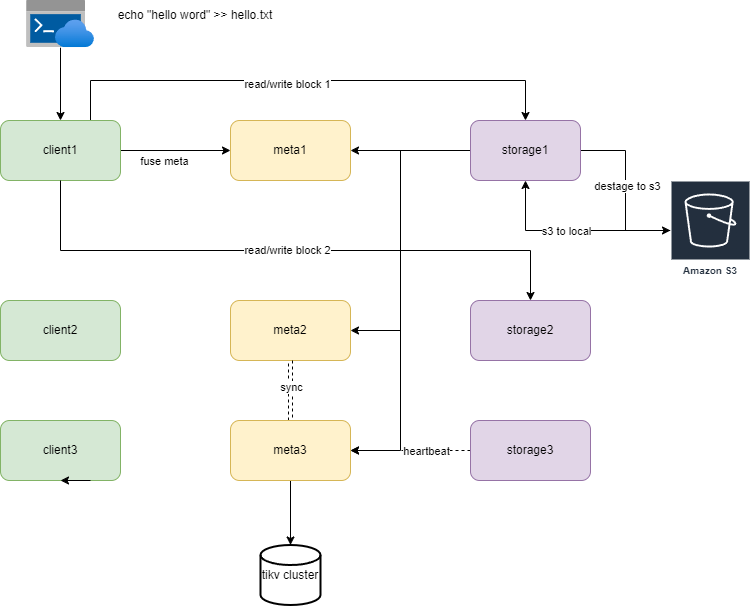

# hugo

A high-performance distributed and cloud-native file system.

## Features(Desires):

- POSIX-compliant semantics
- Massive capacity with acceptable price
- High performance and elasticity
- Consistent and reliable storage
- Horizontal scalability

## Architicture

## Effect

